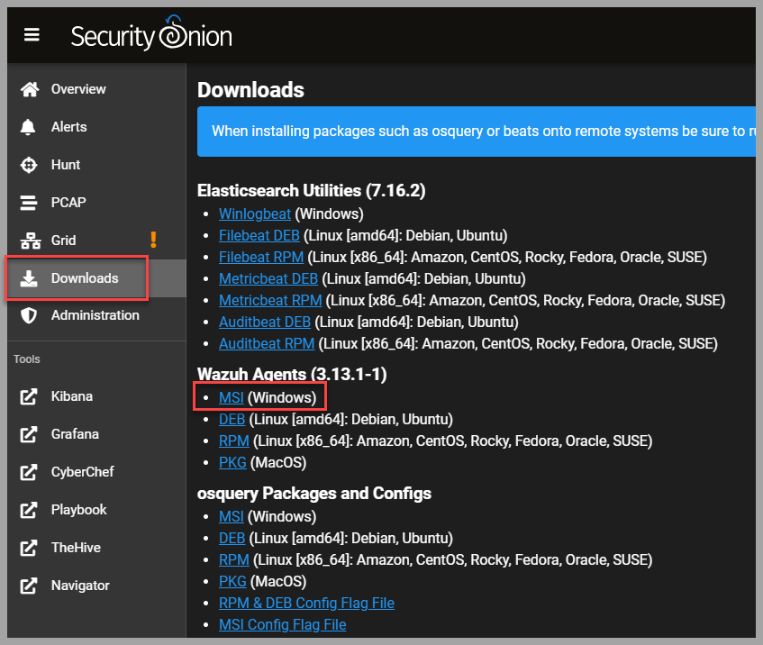

## Task Deploy or Evaluate Host Sensors (Prepare Security Onion to listen for Wazuh agents on the network)  
 

## Conditions  
Given access to a network and the ability to install and configure Security Onion  


## Standards  
* Prepare Security Onion to listen for and recieve sysmon logs through deployed Wazzuh agents  
* Configure Wazzuh agents to forward local sysmon logs on compromised hosts to Security Onion NIDS  


## End State  
Hosts on compromised network utilize wazzuh to forward sysmon and event logs to Security Onion NIDS for parsing in Kibana  


## Notes  


## Manual Steps  


### Set Up  
* `Security Onion Host (Linux - NIDS)`: This is the security onion box that we bring to the environment.  
* `Windows Workstations`: Client hosts at the incident site.  


### Configure Security Onion to receive logs.  
On the Security Onion system, log into the local system. Open two Terminal windows, further referred to as Terminal A and B.  


In Terminal A:  
```bash
sudo so-wazuh-stop
``` 

In Terminal B, run the command to bring "ossec-authd" to the foreground:  
```bash
sudo /var/ossec/bin/ossec-agentd -f 
```

In Terminal A, start ossec again:  
```bash
sudo so-wazuh-start 
```


### Install Software on windows hosts  
* The repository comes with all the necessary files for deployment, but it is preferable to download the Wazuh agent from Security Onion system currently deployed for the mission  
* Login into Security Onion, select `Downloads` from the menu on the left, and download the Wazuh agent for Windows.  Ensure the file is unblocked once downloaded  




* Modify files:   
Edit /scripts/install-sysmon.bat  
Edit IP address to reflect your Security Onion IP address: `/scripts/install-sysmon.bat`  

  

Edit ossec.conf   
Change IP address to reflect your Security Onion address  

  


* Running PowerShell script on Windows hosts  
* Run the PowerShell script:  
  ```powershell
  scripts\Software_Push.ps1
  ```

* Enter domain credentials  
User: Administrator@domain.name  

* Enter Install Parameters  
IP Address: The Ip address of the machine that you are running the script from  
Domain Admin Password: Enter Domain Admin Password  
Domain: Domain name  

* Click `Run` to allow psexec to execute  

  

* Listing Wazuh agents
```bash
so-wazuh-agent-manage
```  


## Dependencies  
* Security Onion NIDS  
* Privileged access to target network hosts.  


## Other available tools  
* Ossec in place of Wazzuh  


## References  
[Installing Wazuh](https://documentation.wazuh.com/3.7/installation-guide/installing-wazuh-agent/index.html)  
[Wazuh](https://securityonion.readthedocs.io/en/latest/wazuh.html)  


## Revision History  
