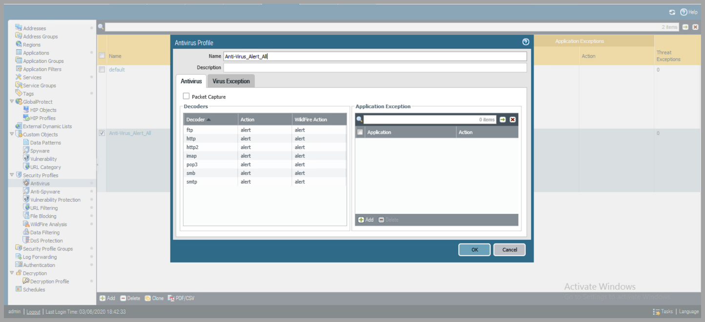
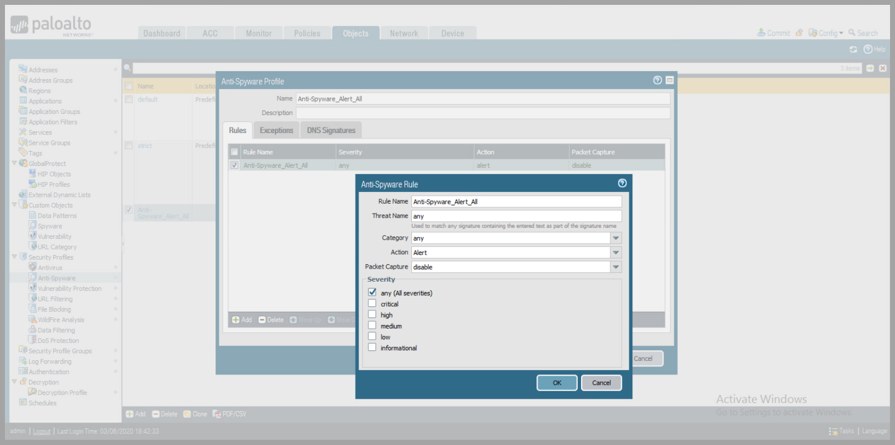
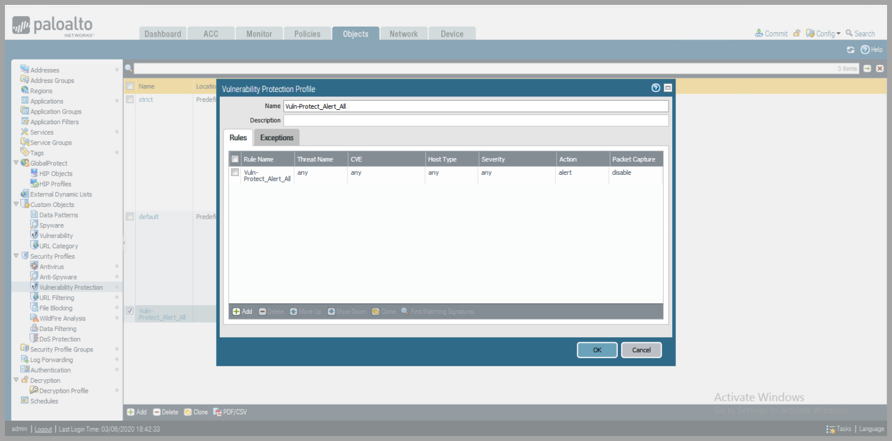
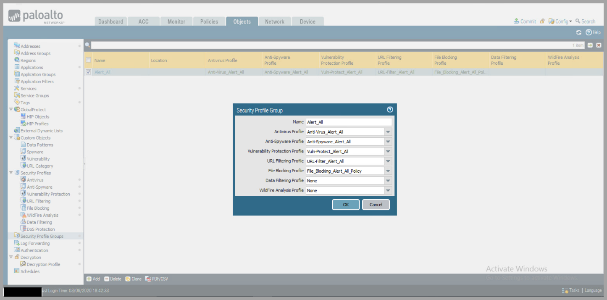
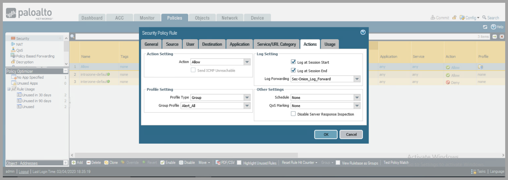

## Task: Configure Palo Alto Networking Device to forward all Alerts and Logs to SysLog Server  

## Conditions  
Given a Palo Alto Networking device and Syslog server.  

## Standards  
* Team member validates Palo Alto device is 'seeing' traffic as intended on target network segments.  
* Team member configures log forwarding to Security Onion device appropriately.  

## End State  
Logs are forwarded and parsed by Security Onion NIDS and searchable in Kibana.  

## Notes  

	
## Manual Steps  
* Log into Palo Alto Networking WebUI  
	* Username: Admin 
	* Password: <get from network owner>  
* Ensure PAN Service route for Syslog messages is set to same subnet as Syslog/SO/SIEM servers  
	* Open Service routes under Device > Setup > Services tab  
	* Select [Service Route Configuration]  
	* Change Service Route Configuration to [Customize]  
		* Either select All Services, or you can define which Interface the respective services use.  
	* Change the service route IP address to Custom  
	* Click `Syslog` under Services  
		* Change `Source Interface` to ethernet interface connected to Syslog servers  
		* Change `Source Address` to IP Address on same subnet of Syslog server  

  

* Create Syslog Server Profile.  This profile should identify the IP of the Syslog server on the network and Port the Syslog server will be listening on for incoming logs.  
	* Device > Server Profiles > Syslog  
	* Select the `Add` button at the bottom  
	* Create any name for the Syslog Profile  
	* Click `Add` button under the newly created profile, and fill in:  
		* Name: Can be anything  
		* Syslog Server: Can be IP or FQDN  
		* Transport: UDP (Default) or TCP – Based on capabilities of network.   
			* Ensure Syslog Server has Firewall configured to accept Syslogs over UDP or TCP  
			* UDP may result in loss of logs due to connectionless communication.   
			* TCP may cause resource exhaustion of networking devices due to increased communication requirements.  
		* Port: 514 (Default)  
			* Ensure Syslog Server has firewall configured to accept Syslogs over port 514.  

  

* Create a Security Profile to Log alerts on ALL network  traffic  
	* Objects > Security Profiles  
	* Create rules to Alert for each of the following:  
		* Antivirus  
			* Add a name for the rule  
			* Change all Actions and Wildfire Actions to Alert  
	
  
  
	
* Create a Security Profile - Continued	
	* Anti-Spyware  
		* Add Profile Name  
		* Click Action drop-down and select `Alert`  
		* Click `OK`  

  
  
  

* Create a Security Profile - Continued  
	* Select `DNS Signature` Tab  
	* Change `Action on DNS Queries` to Alert for both `Palo Alto Content DNS Signatures` and `Palo Alto Network DNS Security`  
	* Click `OK`  

  

* Create a Security Profile - Continued
	* Vulnerability Protection  
		* Add Profile Name  
		* Click `Add,` to add Rule to Profile  
		* Create Rule Name  
		* Change `Action` to `Alert`  
		Click `OK`  

* Create a Security Profile - Continued  
	* URL Filtering  
	* Add Profile Name  
	* Select `Site Access` drop down -> Set All Actions -> Alert  
	* Repeat STEP 2 for `User Credential Submission`  
	* Click `OK`  

* Create a Security Profile - Continued  
	* File Blocking  
	* Click `Add,` to add Rule to Profile  
	* Change `Action` to `Alert`  
	* Click `OK`  

* Create a Security Profile Group  
	* Objects > Security Profile Group  
	* click `add`  
	* Name the Security Profile  
	* change each profile to the previously created rules for Alerting  

* Create Log Forwarding Rule  
	* Objects > Log Forwarding  
	* Click `Add`  
	* Create Profile Name  
	* Click `Add` under the Log Forwarding Profile  

* Create Log Forwarding Rule - Continued  
	* Name the rule  
	* Click `add` under the "Syslog" Forward Method  
	* Select the Syslog Server Profile created previously  

* Attach Logging and Log Forwarding policies to Active Security Policy  
	* Policies > Security  
	* Click on the active security profile name (which is in blue)  
	* select `Actions` tab  
	* Under Profile Setting set the:  
		* Profile Type to `Group`  
		* Group Profile to Security Group Profile created earlier  
	* Under Log Settings  
		* Select `Log at Session Start` and `Session End` Check-Box  
		* Select Log Forwarding Profile previously created  
		* Click `Ok`  

* Configure Palo Alto Network Device to forward logs for System, Configuration , User-ID, HIP Match, and IP-Tag to Syslog Server  
	* Device > Log Settings  
	* for each: System, Configuration , User-ID, HIP Match, and IP-Tag  
		* Click `Add` and name the Log Profile  
		* Under syslog click `Add` and select Syslog Server Profile.  

Commit All Changes  

Click Commit and add a Description of what you added  

Confirm on Syslog Server that it is receiving logs  

## Dependencies  
* Palo Alto Firewall and administrative credentials.  
* Security Onion NIDS to receive logs.  

## Other Available Tools  
* Wireshark with manual analysis.  

## References  
[PAN OS 90 Admin Guide](https://docs.paloaltonetworks.com/pan-os/9-0/pan-os-admin/monitoring/use-syslog-for-monitoring/configure-syslog-monitoring.html#id43889746-3f0f-40aa-bfbe-8a77b8ce7532)  
[PAN Article](https://knowledgebase.paloaltonetworks.com/KCSArticleDetailid=kA10g000000ClSlCAK)  
[PAN Article](https://knowledgebase.paloaltonetworks.com/KCSArticleDetailid=kA10g000000CldNCAS)  

## Revision History  
