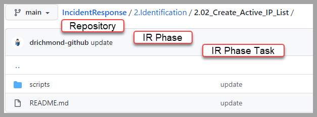

## Concept	
  

* IR Phase - Example: (2.Identification)  
  * README.md Table of Contents for phase tasks  
  * IR Phase Task - Example: (2.02_Create_Active_IP_List)  
    * Scripts  
    * README.md IR Phase Task  

## Script Style Guide  
Name the script the following way.
```bash
# {TaskID}-WhatScriptDoes.(sh/ps1)
2.04-GatherADStructureInformation.ps1
```

### 1. Bash  
Use Camel Case for Variable and Function Names:

```bash
# variable: varCaseFirstLetterofEachWord
# function: funcCaseFirstLetterofEachWord

myVariable="My Variable"

function myFunction {
  # do something...
}
```

### 2. Powershell  
Use Pascal Case for Variable. Function Names should be Verb-Action combination:
```powershell
# variable: VarCaseFirstLetterofEachWord
# function: FuncCaseFirstLetterofEachWord

$MyVariable = "My Variable"

function MyFunction {
  # do something...
}
```

### 3. Python  
Follow PEP 8 Guide Line: https://www.python.org/dev/peps/pep-0008/

## Git Workflow  
### 1. clone the repo  

Once your account has MFA enforced you will need to use an API key.  Make sure you store your API key in a safe place, I would suggest your password manager.
[Generate API Key](https://help.github.com/en/github/authenticating-to-github/creating-a-personal-access-token-for-the-command-line)


```bash
# copy url of this git repo and replace APIKEY with yours generated above
$ git clone https://APIKEY@github.com/cmdcnd/IncidentResponse.git
```

once you clone, at this point, you should only have local copy of `main` branch.
you can check all local branches using

```bash
$ git branch
(output should look)
* main
```

### 2. create a local branch  
create a local branch with name that is related to changes that are being made.
```bash
$ git checkout -b $YOUR_LOCAL_BRANCH_NAME

# if you're working on task 2.04, you can do something like.

$ git checkout -b task-2.04
```

You can check all local branches again.
```bash
$ git branch
(output should look)
  main
* task-2.04
```

you can also jump back and forth different branch using
```bash
$ git checkout $(branch_name)
```

This allows avoiding making changes directly on main which is usually the official branch
where we only want to keep changes that are validated and reviewed.

### 3. complete tasks documenations  
- complete README.md: you can get the template and the example from ./template
- add any scripts if you have one under $(your_tasks_folder)/scripts
- make sure to include detailed steps for running the script.

### 4. add your changes  
any changes to an existing files or a new file will show with red text when you run
```bash
$ git status
```

before commiting, files you want to commit need to be added.
```bash
# adding everything: this has to run at the top level folder that contains any changes that are made.
$ git add .

# or add one at a time: if you want to commit some but leave others.
$ git add $(file_name)
```

if you run the `git status` again, added files should show up green in color.

### 5. commit your changes  
committing will open whatever editor that is set as `core.editor` under
```bash
$ git config --list
```

this is so that you can write a commit message. make sure that
you're comfortable with editor the git is about to open.

once you've confirmed that all files that need to be committed are added,
commit the changes.

```bash
$ git commit
```

make sure to write a meaningful commit message that gives context to what changes are made.
the first line becomes the header,
and add a space and write the body.

When you save and exit our of the editor, commit is complete.  

### 6. push your local branch to remote  
The branch you've created in step 2 is only available locally.  Remote is the central version of repo where everybody can access.  In order to make the branch available at remote, the branch needs to be pushed.  

run this while you are at your branch:
this means when `git branch` has `*` next to the branch you want to push.
```bash
$ git push
```

When you push the local branch for the first time,
`git` will complain because the remote branch does not exist yet for the local branch.
in git, the paired remote branch of the local branch is called the upstream.

```
fatal: The current branch task-2.04 has no upstream branch.
To push the current branch and set the remote as upstream, use

    git push --set-upstream origin task-2.04
```

Run the command the git suggests.
```bash
$ git push --set-upstream origin task-2.04
```

Setting the upstream is required only once for the very first time,
and if you need to push any other changes to your branch afterward,
you can simply do

```bash
$ git push
```
### 7. create a pull request  
Now, the branch with your change is available remote.
when you go to git repo: https://github.com/cmdcnd/IncidentResponse,
you can create a pull request.  

git should show a banner in the main repo as a short cut asking
if you want to make a pull request out of the recent push.

Or, you can click on `create a pull request` button.
choose `main` on the left, and `your branch` on the right.

### References  
Tasks are based on the NIST Framework for Improving Critical Infrastructure Cybersecurity.  
[NIST Framework for Improving Critical Infrastructure Cybersecurity](https://nvlpubs.nist.gov/nistpubs/CSWP/NIST.CSWP.04162018.pdf)  
